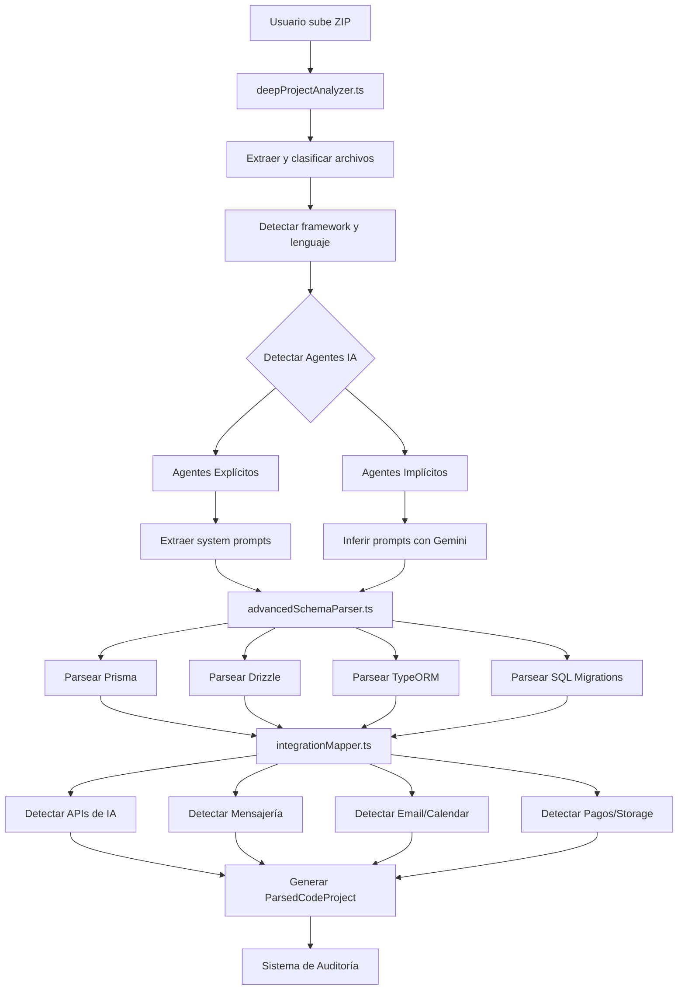

# 🔬 Arquitectura de Análisis Profundo de Proyectos ZIP

## 🎯 Objetivo

Crear un sistema de análisis **exhaustivo** que pueda comprender proyectos complejos en profundidad, detectando:

1. **Agentes IA** (explícitos e implícitos)
2. **Prompts y configuraciones**
3. **Bases de datos** (schemas completos)
4. **Integraciones externas** (APIs, servicios)
5. **Arquitectura y flujos de negocio**

## 🏗️ Componentes del Sistema

### 1. `deepProjectAnalyzer.ts` - Analizador Principal

**Responsabilidad**: Orquestar todo el análisis en múltiples fases.

**Fases de Análisis**:

```typescript
FASE 1: Extracción y Clasificación
  └─> Descomprimir ZIP
  └─> Clasificar archivos (src/, config/, schemas/, tests/)
  └─> Filtrar archivos irrelevantes (node_modules/, dist/)

FASE 2: Análisis de Dependencias
  └─> Parsear package.json / requirements.txt
  └─> Detectar framework principal
  └─> Identificar lenguaje dominante

FASE 3: Detección de Agentes IA (Profunda)
  └─> Detectar agentes EXPLÍCITOS (LangChain, OpenAI, etc.)
  └─> Detectar agentes IMPLÍCITOS (event-driven, handlers)
  └─> Enriquecer con análisis IA (Gemini)

FASE 4: Análisis de Bases de Datos
  └─> Parsear schemas (Prisma, Drizzle, TypeORM, etc.)
  └─> Extraer tablas, campos, relaciones
  └─> Detectar migraciones

FASE 5: Mapeo de Integraciones
  └─> APIs de IA
  └─> Servicios de mensajería
  └─> Email, Calendar, CRM
  └─> Pagos, Storage, Auth

FASE 6: Generación de Modelo Unificado
  └─> Convertir todo a formato ParsedCodeProject
  └─> Compatible con sistema de auditoría existente
```

**API Principal**:

```typescript
export async function deepAnalyzeProject(
  zipBuffer: ArrayBuffer,
  language: string = 'en'
): Promise<ParsedCodeProject>
```

**Retorna**:
- `agents[]` - Todos los agentes detectados con sus prompts
- `databases[]` - Configuraciones de BD detectadas
- `tools[]` - Herramientas externas detectadas
- `apis[]` - APIs y servicios externos
- `summary` - Resumen ejecutivo del proyecto

---

### 2. `advancedSchemaParser.ts` - Parser de Bases de Datos

**Responsabilidad**: Detectar y parsear **cualquier tipo de schema de base de datos**.

**Soporta**:

| ORM/Framework | Archivos | Capacidades |
|---------------|----------|-------------|
| **Prisma** | `.prisma` | Tablas, campos, enums, relaciones, índices |
| **Drizzle** | `.ts` (pgTable, mysqlTable) | Tablas, campos, constraints |
| **TypeORM** | `.ts` (@Entity, @Column) | Entidades, decoradores, relaciones |
| **Sequelize** | `.js/.ts` (sequelize.define) | Modelos, tipos de datos |
| **Mongoose** | `.js/.ts` (new Schema) | Schemas MongoDB, validaciones |
| **SQL Migrations** | `.sql` | CREATE TABLE, ALTER TABLE |

**Ejemplo de Detección Prisma**:

```prisma
model User {
  id        Int      @id @default(autoincrement())
  email     String   @unique
  name      String?
  posts     Post[]
  createdAt DateTime @default(now())
}

model Post {
  id        Int      @id @default(autoincrement())
  title     String
  content   String?
  published Boolean  @default(false)
  author    User     @relation(fields: [authorId], references: [id])
  authorId  Int
}
```

**Resultado Parseado**:

```typescript
{
  provider: 'Prisma',
  type: 'postgresql',
  tables: [
    {
      name: 'User',
      fields: [
        { name: 'id', type: 'Int', nullable: false, autoIncrement: true },
        { name: 'email', type: 'String', nullable: false, unique: true },
        { name: 'name', type: 'String', nullable: true },
        { name: 'posts', type: 'Post[]', nullable: false },
      ],
      primaryKey: 'id'
    },
    {
      name: 'Post',
      fields: [
        { name: 'id', type: 'Int', nullable: false },
        { name: 'title', type: 'String', nullable: false },
        { name: 'author', type: 'User', nullable: false, 
          references: { table: 'User', field: 'id' } 
        },
      ],
      primaryKey: 'id'
    }
  ],
  relationships: [
    {
      type: 'one-to-many',
      from: { table: 'User', field: 'posts' },
      to: { table: 'Post', field: 'author' }
    }
  ]
}
```

**API Principal**:

```typescript
export async function analyzeDatabaseSchemas(
  files: FileContent[]
): Promise<DatabaseSchema[]>
```

---

### 3. `integrationMapper.ts` - Mapeador de Integraciones

**Responsabilidad**: Detectar **todas** las integraciones externas y sus configuraciones.

**Categorías Detectadas**:

#### 🤖 APIs de IA

| Provider | Keywords | Env Vars | Operaciones |
|----------|----------|----------|-------------|
| OpenAI | `openai`, `ChatCompletion` | `OPENAI_API_KEY` | `chat.completions.create` |
| Anthropic | `anthropic`, `messages.create` | `ANTHROPIC_API_KEY` | `messages.create` |
| Google AI | `@google/generative-ai`, `gemini` | `GEMINI_API_KEY` | `generateContent` |
| Hugging Face | `@huggingface`, `inference` | `HF_TOKEN` | `textGeneration` |

#### 💬 Servicios de Mensajería

| Provider | Keywords | Env Vars | Operaciones |
|----------|----------|----------|-------------|
| WhatsApp | `baileys`, `makeWASocket` | `WHATSAPP_PHONE` | `sendMessage`, `sendImage` |
| Twilio | `twilio`, `messages.create` | `TWILIO_AUTH_TOKEN` | `messages.create`, `calls.create` |
| Telegram | `telegraf`, `bot.sendMessage` | `TELEGRAM_BOT_TOKEN` | `sendMessage`, `sendPhoto` |
| Slack | `@slack/bolt`, `chat.postMessage` | `SLACK_BOT_TOKEN` | `chat.postMessage` |

#### 📧 Email

| Provider | Keywords | Env Vars | Operaciones |
|----------|----------|----------|-------------|
| SendGrid | `@sendgrid/mail` | `SENDGRID_API_KEY` | `send`, `sendMultiple` |
| Nodemailer | `nodemailer`, `createTransport` | `SMTP_HOST`, `SMTP_PASS` | `sendMail` |
| Resend | `resend`, `emails.send` | `RESEND_API_KEY` | `emails.send` |

#### 📅 Calendarios

| Provider | Keywords | Env Vars | Operaciones |
|----------|----------|----------|-------------|
| Google Calendar | `googleapis`, `calendar.events` | `GOOGLE_CLIENT_ID` | `events.insert`, `events.list` |
| Outlook | `@microsoft/microsoft-graph-client` | `MICROSOFT_CLIENT_ID` | `calendar.events.create` |

#### 💳 Pagos

| Provider | Keywords | Env Vars | Operaciones |
|----------|----------|----------|-------------|
| Stripe | `stripe`, `paymentIntents.create` | `STRIPE_SECRET_KEY` | `charges.create`, `subscriptions.create` |
| PayPal | `@paypal/checkout-server-sdk` | `PAYPAL_CLIENT_SECRET` | `orders.create`, `payments.create` |

#### 🗄️ Storage

| Provider | Keywords | Env Vars | Operaciones |
|----------|----------|----------|-------------|
| AWS S3 | `@aws-sdk/client-s3` | `AWS_ACCESS_KEY_ID` | `putObject`, `getObject` |
| Google Cloud Storage | `@google-cloud/storage` | `GOOGLE_CLOUD_PROJECT` | `upload`, `download` |
| Cloudinary | `cloudinary`, `uploader.upload` | `CLOUDINARY_API_KEY` | `upload`, `destroy` |

**Detección de Webhooks**:

```typescript
// Detecta automáticamente endpoints webhook
app.post('/webhook/stripe', ...);        // ✅ Detectado
router.post('/api/webhook/twilio', ...); // ✅ Detectado
```

**API Principal**:

```typescript
export async function detectIntegrations(
  files: FileContent[]
): Promise<IntegrationDetection[]>
```

---

## 🔄 Flujo Completo de Análisis



---

## 📊 Formato de Salida: `ParsedCodeProject`

```typescript
interface ParsedCodeProject {
  // Metadatos
  projectType: 'nodejs' | 'typescript' | 'python';
  framework?: DetectedFramework;
  language: string;
  confidence: number;
  
  // Componentes detectados
  agents: CodeAgentComponent[];      // 🤖 Agentes IA con prompts
  tools: DetectedTool[];            // 🔧 Herramientas externas
  databases: DetectedDatabase[];    // 💾 Configuraciones de BD
  apis: DetectedAPI[];              // 🔌 APIs externas
  
  // Información del proyecto
  dependencies: Record<string, string>;
  scripts: Record<string, string>;
  fileCount: number;
  totalLines: number;
  summary: string;
  
  // Para auditoría
  apiEndpoints?: string[];
  environmentVariables?: string[];
}
```

**Ejemplo Completo**:

```typescript
{
  projectType: 'typescript',
  framework: {
    name: 'Express',
    confidence: 0.9,
    evidence: ['express in package.json']
  },
  language: 'TypeScript',
  confidence: 0.95,
  
  agents: [
    {
      type: 'agent',
      name: 'Customer Support Agent',
      filePath: 'src/agents/customerSupport.ts',
      systemPrompt: 'You are a helpful customer support agent...',
      framework: 'LangChain',
      tools: ['searchDatabase', 'sendEmail', 'createTicket'],
      confidence: 0.95,
      agentDetectionType: 'EXPLICIT'
    },
    {
      type: 'agent',
      name: 'Order Processing Agent',
      filePath: 'src/handlers/orderHandler.ts',
      systemPrompt: 'Implicit agent that processes customer orders...',
      framework: 'Implicit/Event-Driven',
      behaviors: [
        { name: 'validateOrder', type: 'validation' },
        { name: 'processPayment', type: 'processing' }
      ],
      confidence: 0.7,
      agentDetectionType: 'IMPLICIT'
    }
  ],
  
  databases: [
    {
      provider: 'Prisma/PostgreSQL',
      confidence: 0.95,
      evidence: ['schema.prisma'],
      credentials: ['DATABASE_URL']
    }
  ],
  
  tools: [
    {
      name: 'SendGrid',
      type: 'email',
      confidence: 0.95,
      evidence: ['@sendgrid/mail in dependencies']
    },
    {
      name: 'Stripe',
      type: 'payment',
      confidence: 0.9,
      evidence: ['stripe.paymentIntents.create found']
    }
  ],
  
  apis: [
    {
      service: 'OpenAI',
      type: 'ai',
      confidence: 0.95,
      evidence: ['openai in dependencies', 'ChatCompletion calls']
    }
  ],
  
  summary: 'Express backend, 2 AI agents, Prisma/PostgreSQL, 2 tools',
  fileCount: 47,
  totalLines: 3542,
  apiEndpoints: [
    'POST /api/chat',
    'POST /api/orders',
    'GET /api/orders/:id'
  ],
  environmentVariables: [
    'OPENAI_API_KEY',
    'DATABASE_URL',
    'SENDGRID_API_KEY',
    'STRIPE_SECRET_KEY'
  ]
}
```

---

## 🔍 Detección de Agentes: Explícitos vs Implícitos

### Agentes EXPLÍCITOS

**Características**:
- Usan frameworks conocidos (LangChain, OpenAI SDK, Anthropic)
- Tienen `system_prompt` explícito en el código
- Mecanismo de tools/function calling visible
- Fácil de detectar con regex/AST

**Ejemplo**:

```typescript
const agent = new ChatOpenAI({
  modelName: 'gpt-4',
  systemPrompt: 'You are a helpful assistant that...'
});

agent.invoke([
  { role: 'system', content: systemPrompt },
  { role: 'user', content: userMessage }
]);
```

**Detección**: 
- ✅ Buscar imports: `openai`, `langchain`, `anthropic`
- ✅ Buscar patrones: `ChatOpenAI`, `AgentExecutor`, `messages.create`
- ✅ Extraer `systemPrompt` directamente

---

### Agentes IMPLÍCITOS

**Características**:
- Lógica de negocio codificada (no hay system prompt)
- Basados en eventos/handlers (Express routes, webhooks)
- Comportamiento definido en `if/else`, `switch`, state machines
- **Más difícil de detectar** - requiere análisis semántico

**Ejemplo**:

```typescript
// orderHandler.ts
export async function handleOrder(req, res) {
  const { items, userId } = req.body;
  
  // Validar inventario
  if (!await checkInventory(items)) {
    return res.status(400).json({ error: 'Out of stock' });
  }
  
  // Procesar pago
  const payment = await stripe.charges.create({
    amount: calculateTotal(items),
    currency: 'usd',
    customer: userId
  });
  
  // Crear pedido en BD
  const order = await prisma.order.create({
    data: { userId, items, total: payment.amount }
  });
  
  // Enviar confirmación
  await sendEmail(userId, 'Order Confirmed', orderDetails);
  
  return res.json({ orderId: order.id });
}
```

**Este código NO tiene system prompt**, pero actúa como un agente que:
1. **Valida** inventario
2. **Procesa** pagos (usa Stripe)
3. **Persiste** en BD (usa Prisma)
4. **Comunica** por email (usa SendGrid)

**Detección**:
- ✅ Buscar archivos con nombres: `handler`, `controller`, `service`
- ✅ Extraer comportamientos: `validateOrder`, `processPayment`
- ✅ Identificar tools usados: Stripe, Prisma, SendGrid
- ✅ **Inferir system prompt con Gemini IA**

**System Prompt Inferido**:

```
"You are an order processing agent responsible for:
1. Validating product availability in inventory
2. Processing payments securely through Stripe
3. Creating order records in the database
4. Sending confirmation emails to customers

You handle errors gracefully and ensure all steps complete successfully."
```

---

## 🧠 Uso de IA para Enriquecimiento

Usamos **Gemini AI** para:

1. **Inferir system prompts** de agentes implícitos
2. **Clasificar comportamientos** (greeting, validation, processing)
3. **Generar resúmenes** ejecutivos del proyecto
4. **Detectar flujos de negocio** complejos

**Prompt para Inferencia**:

```typescript
const prompt = `
You are an expert at analyzing implicit AI agents in code.

Here's a handler file with multiple behaviors:

FILE: orderHandler.ts

CODE SNIPPET:
\`\`\`typescript
export async function handleOrder(req, res) {
  // ... código del agente ...
}
\`\`\`

DETECTED BEHAVIORS:
- validateOrder: validation, tools=Prisma, db=PostgreSQL
- processPayment: processing, tools=Stripe
- sendConfirmation: communication, tools=Email

Based on this, write the IMPLICIT system prompt that describes:
1. What this agent does (its role)
2. How it processes information
3. What tools/databases it uses
4. Expected behavior patterns

Write ONLY the system prompt in natural language.
RESPOND IN SPANISH
`;
```

---

## 🎯 Ventajas sobre Análisis Básico

| Característica | Análisis Básico (n8n) | Análisis Profundo (ZIP) |
|----------------|------------------------|-------------------------|
| **Agentes detectados** | Solo nodos n8n AI | Explícitos + Implícitos |
| **System prompts** | Campos configurados | Extracción completa + inferencia IA |
| **Bases de datos** | URL de conexión | Schemas completos (tablas, campos, relaciones) |
| **Integraciones** | Nodos n8n conocidos | 50+ servicios detectados automáticamente |
| **Credenciales** | Manual (usuario las carga) | Auto-detectadas (env vars) |
| **Complejidad** | Workflows simples | Proyectos enterprise completos |
| **Arquitectura** | Flujo lineal n8n | Event-driven, microservicios, APIs |

---

## 📋 Checklist de Implementación

### ✅ Completado

- [x] `deepProjectAnalyzer.ts` - Analizador principal con 6 fases
- [x] `advancedSchemaParser.ts` - Parser de 6 tipos de BD
- [x] `integrationMapper.ts` - Detección de 50+ servicios
- [x] Detección de agentes explícitos (LangChain, OpenAI, Anthropic)
- [x] Detección de agentes implícitos (handlers, controllers)
- [x] Inferencia de system prompts con Gemini AI
- [x] Extracción de prompts multilineales
- [x] Parseo de Prisma, Drizzle, TypeORM, Mongoose, SQL
- [x] Detección de APIs de IA (OpenAI, Anthropic, Google, HuggingFace)
- [x] Detección de mensajería (WhatsApp, Twilio, Telegram, Slack)
- [x] Detección de email (SendGrid, Nodemailer, Resend, SES)
- [x] Detección de calendarios (Google, Outlook)
- [x] Detección de pagos (Stripe, PayPal, Mercado Pago)
- [x] Detección de storage (S3, GCS, Azure Blob, Cloudinary)
- [x] Detección de auth (Auth0, Clerk, Firebase Auth)
- [x] Detección de webhooks customizados
- [x] Detección de APIs REST/GraphQL externas

### 🔄 Pendiente

- [ ] Integración con `AgentConfig.tsx`
- [ ] Adaptador `codeProjectAdapter.ts` mejorado
- [ ] UI para mostrar schemas de BD en el reporte
- [ ] UI para mostrar integraciones detectadas
- [ ] Caché de análisis (evitar re-analizar ZIPs idénticos)
- [ ] Análisis de flujos de negocio (business flows)
- [ ] Detección de patrones arquitectónicos (MVC, Microservices, etc.)
- [ ] Soporte para Python (FastAPI, Django)
- [ ] Soporte para Java (Spring Boot)
- [ ] Tests unitarios para cada parser

---

## 🚀 Próximos Pasos

1. **Integrar con UI**: Modificar `AgentConfig.tsx` para usar `deepProjectAnalyzer`
2. **Mostrar schemas en reporte**: Agregar sección de BD en `AuditReport.tsx`
3. **Mostrar integraciones**: Listar servicios detectados y credenciales necesarias
4. **Mejorar adaptador**: `codeProjectAdapter.ts` debe transformar `ParsedCodeProject` → nodos de workflow
5. **Caché**: Guardar análisis en localStorage para evitar re-procesar
6. **Tests**: Crear suite de tests con proyectos reales

---

## 📚 Referencias

- **AST Parsing**: `services/astAnalyzer.ts`
- **Dependency Analysis**: `services/dependencyAnalyzer.ts`
- **Workflow Adapter**: `services/codeProjectAdapter.ts`
- **Current ZIP Handler**: `services/zipHandler.ts`
- **Agent Config UI**: `components/AgentConfig.tsx`

---

## 💡 Casos de Uso

### Caso 1: Proyecto LangChain + Supabase

```
Input: proyecto-chatbot.zip
  ├── src/
  │   ├── agent.ts         (LangChain agent con tools)
  │   ├── tools/
  │   │   ├── search.ts
  │   │   └── email.ts
  │   └── db/
  │       └── schema.prisma
  └── package.json

Output:
  ✅ 1 agente explícito: "Customer Support Agent"
  ✅ System prompt: "You are a helpful assistant..."
  ✅ 2 tools: searchDatabase, sendEmail
  ✅ BD: Prisma/PostgreSQL (3 tablas: users, conversations, messages)
  ✅ Integraciones: OpenAI, SendGrid, Supabase
```

### Caso 2: Proyecto Event-Driven sin Framework

```
Input: backend-api.zip
  ├── src/
  │   ├── handlers/
  │   │   ├── orderHandler.ts
  │   │   ├── userHandler.ts
  │   │   └── webhookHandler.ts
  │   ├── services/
  │   │   ├── stripe.ts
  │   │   └── email.ts
  │   └── prisma/
  │       └── schema.prisma
  └── package.json

Output:
  ✅ 3 agentes implícitos detectados
  ✅ System prompts inferidos con Gemini
  ✅ BD: Prisma/PostgreSQL (5 tablas con relaciones)
  ✅ Integraciones: Stripe, SendGrid, Webhooks
  ✅ Endpoints: POST /api/orders, POST /webhooks/stripe
```

---

## 🎓 Conclusión

Este sistema de análisis profundo permite auditar **proyectos reales complejos** con la misma facilidad que workflows n8n simples. 

La combinación de:
- **AST parsing** (análisis sintáctico)
- **Pattern matching** (detección de patrones)
- **AI inference** (inferencia semántica con Gemini)

...permite comprender proyectos que antes eran imposibles de auditar automáticamente. 🚀
