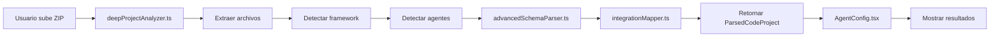
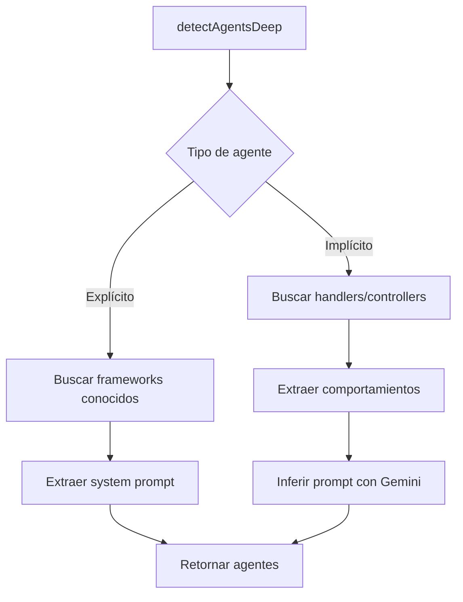

# 📚 Índice Completo de Documentación - Sistema de Análisis Profundo

## 🎯 Documentos Principales

### 1. **DEEP_ANALYSIS_ARCHITECTURE.md** ⭐
**Descripción**: Arquitectura completa del sistema de análisis profundo  
**Para quién**: Desarrolladores que quieran entender cómo funciona  
**Contenido**:
- Componentes del sistema (3 módulos principales)
- Fases de análisis (6 fases)
- Tipos de agentes (explícitos vs implícitos)
- Formato de salida (`ParsedCodeProject`)
- Diagramas de flujo
- Ejemplos completos

**📖 Leer primero si**: Quieres entender la arquitectura interna

---

### 2. **GUIA_USO_DEEP_ANALYZER.md** ⭐⭐⭐
**Descripción**: Guía práctica de uso con ejemplos reales  
**Para quién**: Desarrolladores y usuarios finales  
**Contenido**:
- Cómo usar desde UI y código
- Ejemplos de proyectos reales (WhatsApp bot, LangChain backend)
- Tipos de agentes detectados (con código)
- Schemas de BD parseados
- Integraciones detectadas (50+ servicios)
- Troubleshooting común

**📖 Leer primero si**: Quieres usar el sistema YA

---

## 🔧 Módulos del Sistema

### Core Analyzers

#### 1. `services/deepProjectAnalyzer.ts`
**Responsabilidad**: Orquestador principal del análisis  
**Funciones clave**:
- `deepAnalyzeProject()` - Análisis completo en 6 fases
- `extractAndClassifyFiles()` - Extracción del ZIP
- `detectAgentsDeep()` - Detección de agentes IA
- `analyzeDatabaseSchemas()` - Análisis de BD

**Dependencias**:
- `advancedSchemaParser.ts`
- `integrationMapper.ts`
- `astAnalyzer.ts`
- `dependencyAnalyzer.ts`

---

#### 2. `services/advancedSchemaParser.ts`
**Responsabilidad**: Parser de schemas de bases de datos  
**Funciones clave**:
- `analyzeDatabaseSchemas()` - Detección automática
- `parsePrismaSchemas()` - Parser Prisma
- `parseDrizzleSchemas()` - Parser Drizzle
- `parseTypeORMEntities()` - Parser TypeORM
- `parseMongooseSchemas()` - Parser Mongoose
- `parseSQLMigrations()` - Parser SQL
- `parseSequelizeModels()` - Parser Sequelize

**Soporta**:
| ORM | Formato | Capacidades |
|-----|---------|-------------|
| Prisma | `.prisma` | Tablas, relaciones, enums, índices |
| Drizzle | `.ts` (pgTable) | Tablas, campos, constraints |
| TypeORM | `.ts` (@Entity) | Entidades, decoradores |
| Mongoose | `.ts` (new Schema) | Schemas MongoDB |
| SQL | `.sql` | Migraciones CREATE/ALTER TABLE |
| Sequelize | `.js/.ts` | Modelos sequelize.define |

---

#### 3. `services/integrationMapper.ts`
**Responsabilidad**: Detector de integraciones externas  
**Funciones clave**:
- `detectIntegrations()` - Detección de 50+ servicios
- `detectCategory()` - Clasificación por categoría
- `detectWebhooks()` - Endpoints webhook
- `detectCustomAPIs()` - APIs REST/GraphQL

**Categorías Detectadas**:
- **AI APIs**: OpenAI, Anthropic, Google AI, Hugging Face, Cohere
- **Messaging**: WhatsApp, Twilio, Telegram, Slack, Discord
- **Email**: SendGrid, Nodemailer, Mailgun, Resend, SES
- **Calendar**: Google Calendar, Outlook
- **CRM**: Salesforce, HubSpot, Pipedrive
- **Payment**: Stripe, PayPal, Mercado Pago
- **Storage**: AWS S3, GCS, Azure Blob, Cloudinary
- **Auth**: Auth0, Clerk, Firebase Auth
- **Webhooks**: Customizados

---

### Módulos de Soporte

#### 4. `services/astAnalyzer.ts`
**Responsabilidad**: Análisis AST (Abstract Syntax Tree)  
**Funciones clave**:
- `analyzeProjectWithAST()` - Parsing estructural de código
- `parseFile()` - Parser individual de archivos
- `extractFunctions()` - Extracción de funciones
- `extractClasses()` - Extracción de clases
- `extractImports()` - Extracción de imports

**Usado por**: `deepProjectAnalyzer.ts` para análisis estructural

---

#### 5. `services/dependencyAnalyzer.ts`
**Responsabilidad**: Análisis de dependencias entre módulos  
**Funciones clave**:
- `buildDependencyGraph()` - Grafo de dependencias
- `groupFilesByModule()` - Agrupación por módulos
- `findMainModules()` - Identificación de entry points

**Usado por**: `deepProjectAnalyzer.ts` para detectar módulos principales

---

#### 6. `services/codeProjectAdapter.ts`
**Responsabilidad**: Adaptador entre `ParsedCodeProject` y workflow  
**Funciones clave**:
- `adaptCodeProjectToWorkflow()` - Conversión a nodos
- `createAgentNodes()` - Crear nodos de agentes
- `createToolNodes()` - Crear nodos de herramientas

**Usado por**: `AgentConfig.tsx` para mostrar en UI

---

### Servicios Legacy (Compatibilidad)

#### 7. `services/codeProjectAnalyzer.ts`
**Status**: ⚠️ Legacy - reemplazado por `deepProjectAnalyzer.ts`  
**Mantener por**: Compatibilidad con código existente  
**Migración**: Usar `deepProjectAnalyzer.ts` en nuevos proyectos

#### 8. `services/codeAgentParser.ts`
**Status**: ⚠️ Legacy - funcionalidad absorbida  
**Mantener por**: Compatibilidad

---

## 📊 Tipos y Estructuras

### Tipos Principales (types.ts)

#### `ParsedCodeProject`
Resultado del análisis completo:
```typescript
interface ParsedCodeProject {
  projectType: 'nodejs' | 'typescript' | 'python';
  framework?: DetectedFramework;
  language: string;
  confidence: number;
  
  agents: CodeAgentComponent[];      // Agentes IA detectados
  tools: DetectedTool[];             // Herramientas externas
  databases: DetectedDatabase[];     // Configuraciones BD
  apis: DetectedAPI[];               // APIs externas
  
  dependencies: Record<string, string>;
  scripts: Record<string, string>;
  fileCount: number;
  totalLines: number;
  summary: string;
  
  apiEndpoints?: string[];
  environmentVariables?: string[];
  
  agentDetectionType?: AgentDetectionType;
  implicitAgentAnalysis?: ImplicitAgentAnalysis;
}
```

#### `CodeAgentComponent`
Agente IA detectado:
```typescript
interface CodeAgentComponent {
  type: 'agent' | 'tool' | 'middleware' | 'service';
  name: string;
  filePath: string;
  systemPrompt?: string;
  description: string;
  imports: string[];
  
  framework?: string;                    // 'LangChain', 'OpenAI', etc.
  tools?: string[];                      // Herramientas del agente
  confidence?: number;
  
  agentDetectionType?: AgentDetectionType;  // EXPLICIT o IMPLICIT
  behaviors?: AgentBehavior[];           // Para implícitos
  handlers?: { name: string; filePath: string }[];
  estimatedIntention?: string;
}
```

#### `AgentDetectionType`
```typescript
enum AgentDetectionType {
  EXPLICIT = "explicit",    // LangChain, OpenAI SDK
  IMPLICIT = "implicit",    // Event-driven, handlers
  HYBRID = "hybrid",        // Mix
  UNKNOWN = "unknown"
}
```

#### `AgentBehavior`
Comportamiento de agente implícito:
```typescript
interface AgentBehavior {
  name: string;
  type: 'greeting' | 'validation' | 'retrieval' | 'processing' | 'unknown';
  description?: string;
  inputTypes: string[];
  outputTypes: string[];
  toolsUsed: string[];
  databasesUsed: string[];
  conditionChecks: string[];
  confidenceScore: number;
}
```

---

## 🎨 Componentes UI

### React Components

#### `components/AgentConfig.tsx`
**Responsabilidad**: Configuración de auditoría  
**Funcionalidades**:
- Upload de ZIP o n8n JSON
- Detección automática de tipo
- Configuración de criterios
- Configuración de credenciales
- Inicio de auditoría

**Hooks**:
- `useState` - Estado de configuración
- `useTranslation` - Internacionalización

#### `components/AuditReport.tsx`
**Responsabilidad**: Visualización de resultados  
**Funcionalidades**:
- Resumen ejecutivo
- Desglose por test case
- Puntuación y hallazgos
- Actividad de BD (si aplica)

#### `components/LiveAuditView.tsx`
**Responsabilidad**: Visualización en tiempo real  
**Funcionalidades**:
- Progress por test case
- Detalles de conversación
- Indicadores de estado

---

## 🔄 Flujos de Trabajo

### Flujo 1: Análisis de ZIP



### Flujo 2: Detección de Agentes



### Flujo 3: Parsing de BD

```mermaid
graph TD
    A[analyzeDatabaseSchemas] --> B{Detectar tipo}
    
    B -->|.prisma| C[parsePrismaSchemas]
    B -->|pgTable| D[parseDrizzleSchemas]
    B -->|@Entity| E[parseTypeORMEntities]
    B -->|new Schema| F[parseMongooseSchemas]
    B -->|.sql| G[parseSQLMigrations]
    
    C --> H[Retornar schemas]
    D --> H
    E --> H
    F --> H
    G --> H
```

---

## 📖 Documentos Adicionales

### Documentación Legacy (Referencia)

| Documento | Status | Descripción |
|-----------|--------|-------------|
| `ANALISIS_PROFUNDO_N8N_A_TYPESCRIPT.md` | ⚠️ Legacy | Análisis de conversión n8n → TS |
| `ARQUITECTURA_TYPESCRIPT_AUDIT.md` | ⚠️ Legacy | Arquitectura antigua |
| `COMPARATIVA_ANTES_DESPUES.md` | ℹ️ Info | Comparación de versiones |
| `CRITICA_DETECCION_AGENTES_IA.md` | ℹ️ Info | Críticas del sistema anterior |

### Documentación de Features

| Documento | Descripción |
|-----------|-------------|
| `AUDITORIA_REAL_COMPLETA_FINAL.md` | Auditoría con endpoints reales |
| `CHANGELOG_DATABASE.md` | Tracking de cambios en BD |
| `FIX_DETECCION_AUTOMATICA_UNIVERSAL.md` | Mejoras de detección |

---

## 🚀 Quick Start

### Para Desarrolladores

1. **Lee primero**: `GUIA_USO_DEEP_ANALYZER.md`
2. **Entiende arquitectura**: `DEEP_ANALYSIS_ARCHITECTURE.md`
3. **Explora código**:
   - `services/deepProjectAnalyzer.ts`
   - `services/advancedSchemaParser.ts`
   - `services/integrationMapper.ts`
4. **Prueba**:
   ```typescript
   import { deepAnalyzeProject } from './services/deepProjectAnalyzer';
   const analysis = await deepAnalyzeProject(zipBuffer, 'es');
   console.log(analysis);
   ```

### Para Usuarios

1. **Lee**: `GUIA_USO_DEEP_ANALYZER.md` (secciones de uso)
2. **Sube tu proyecto** en AgentConfig.tsx
3. **Configura criterios** de auditoría
4. **Ejecuta** y obtén reporte

---

## 🔧 Mantenimiento

### Agregar Nuevo Parser de BD

1. Crear función en `advancedSchemaParser.ts`:
   ```typescript
   function parseMyORMSchemas(files: FileContent[]): DatabaseSchema[]
   ```

2. Agregar a `analyzeDatabaseSchemas()`:
   ```typescript
   const myOrmFiles = files.filter(f => f.content.includes('myORM'));
   if (myOrmFiles.length > 0) {
     const schemas = parseMyORMSchemas(myOrmFiles);
     schemas.push(...schemas);
   }
   ```

### Agregar Nueva Integración

1. Agregar patrón en `integrationMapper.ts`:
   ```typescript
   const NEW_SERVICE_PATTERNS = {
     myservice: {
       provider: 'My Service',
       keywords: ['myservice', 'MyServiceClient'],
       envVars: ['MY_SERVICE_API_KEY'],
       operations: ['doSomething', 'doOther'],
     }
   };
   ```

2. Agregar a categoría correspondiente en `detectIntegrations()`

### Agregar Nuevo Lenguaje

1. Crear parser en `services/` (ej: `pythonProjectAnalyzer.ts`)
2. Implementar interfaz compatible con `ParsedCodeProject`
3. Agregar switch en `deepProjectAnalyzer.ts`:
   ```typescript
   if (language === 'python') {
     return await analyzePythonProject(zipBuffer);
   }
   ```

---

## 📞 Soporte

**¿Dudas?**
1. Revisa `GUIA_USO_DEEP_ANALYZER.md` (sección Troubleshooting)
2. Consulta `DEEP_ANALYSIS_ARCHITECTURE.md` (arquitectura)
3. Examina código fuente con comentarios

**¿Encontraste un bug?**
1. Crea issue con ejemplo de proyecto que falla
2. Incluye logs de console
3. Especifica tipo de proyecto y framework

---

## 🎓 Conclusión

Este sistema permite auditar proyectos reales complejos con:
- **Detección inteligente** de agentes (explícitos e implícitos)
- **Parsing automático** de 6 tipos de BD
- **Mapeo completo** de 50+ integraciones
- **Análisis semántico** con Gemini IA

**Documentación completa** en:
- `DEEP_ANALYSIS_ARCHITECTURE.md` - Arquitectura
- `GUIA_USO_DEEP_ANALYZER.md` - Uso práctico

¡A auditar! 🚀
